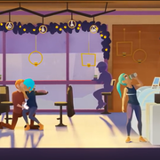
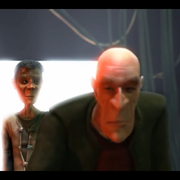
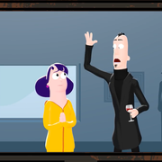

# shotit-frontend

The frontend of shotit, with full documentation.

# Website

This website is built using [Docusaurus 2](https://docusaurus.io/), a modern static website generator.

### Installation

```
$ yarn
```

### Local Development

```
$ yarn start
```

This command starts a local development server and opens up a browser window. Most changes are reflected live without having to restart the server.

### Build

```
$ yarn build
```

This command generates static content into the `build` directory and can be served using any static contents hosting service.

### Deployment

Using SSH:

```
$ USE_SSH=true yarn deploy
```

Not using SSH:

```
$ For Linux/OSX:
$ GIT_USER=<Your GitHub username> yarn deploy

$ For Windows:
$ cmd /C "set "GIT_USER=<GITHUB_USERNAME>" && yarn deploy"
```

If you are using GitHub pages for hosting, this command is a convenient way to build the website and push to the `gh-pages` branch.








